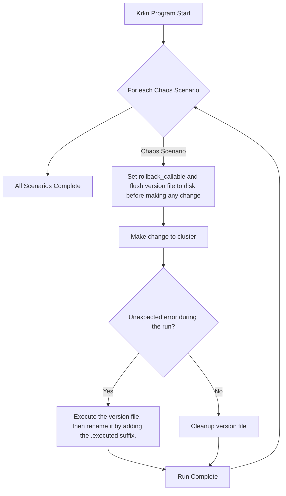

### Table of Contents

- [Concept](#concept)
- [Supported Rollback Scenarios](#supported-rollback-scenarios)
- [Rollback Command](#rollback-command)
- [Configuration of Rollback](#configuration-of-rollback)
- [Details of Rollback Scenario](#details-of-rollback-scenario)
    - [Lifecycle of Rollback](#lifecycle-of-rollback)
    - [Version Files Directory Structure](#version-files-directory-structure)
    - [Version File Content](#version-file-content)

## Concept

Krkn supports a human-readable, **versioned file-based** rollback mechanism inspired by [Alembic](https://alembic.sqlalchemy.org/en/latest/), generating Python version files for changes made during chaos scenarios.

With this approach, Krkn ensures:
- Rollback operations are reliably persisted to disk, even in the event of unexpected program failures.
- Version files clearly document the changes made during chaos scenarios in a human-readable format.
- Specific changes can be easily identified and restored during rollback.
- A concise and transparent history of all modifications made throughout chaos testing.


## Supported Rollback Scenarios

Krkn supports rollback for the following scenarios.

- [Application outages](../scenarios/application-outage/_index.md)
- [KubeVirt VM Outage](../scenarios/kubevirt-vm-outage-scenario/_index.md)
- [Hog Scenarios](../scenarios/hog-scenarios/_index.md)
    - [Node CPU Hog](../scenarios/hog-scenarios/cpu-hog-scenario/_index.md)
    - [Node IO Hog](../scenarios/hog-scenarios/io-hog-scenario/_index.md)
    - [Node Memory Hog](../scenarios/hog-scenarios/memory-hog-scenario/_index.md)

## Rollback Command

Krkn provides `list-rollback` and `execute-rollback` commands for managing rollback operations.

- `list-rollback`: List rollback version files in a tree-like format
    - `-r RUN_UUID, --run_uuid=RUN_UUID` Flag: **Optional**. Specify the Run UUID to filter the list of rollback version files.
    - `-s SCENARIO_TYPE, --scenario_type=SCENARIO_TYPE` Flag: **Optional**. Specify the Scenario Type to filter the list of rollback version files.
    - Example Usage:
        ```bash
        # Without filtering
        python run_kraken.py list-rollback --config config/config.yaml

        # With filtering by Run UUID
        python run_kraken.py list-rollback --config config/config.yaml -r <run_uuid>

        # With filtering by Scenario Type
        python run_kraken.py list-rollback --config config/config.yaml -s <scenario_type>

        # With filtering by both Run UUID and Scenario Type
        python run_kraken.py list-rollback --config config/config.yaml -r <run_uuid> -s <scenario_type>
        ```
    - Example Output:
        ```
        /tmp/kraken-rollback/
        ├── 1755488223093251000-168dce4c-fdb4-4e8c-aa5b-7f919777801b
        │   └── network_chaos_scenarios_1755488221668750000_fphcbojh.py
        ├── 1755496143932815000-7d32bf81-2c0d-4d56-b75b-b0702b2c45f9
        │   └── network_chaos_ng_scenarios_1755496142436906000_btmcxrri.py
        └── 1755523261039221000-0ddd9f07-bcd8-47bc-bf89-f9c4f2503ead
        ```
- `execute-rollback`: Execute rollback version files and cleanup if successful
    - By default, **all version files** located in the `rollback_versions_directory` (`/tmp/kraken-rollback/`) will be executed.
    - The version files will be renamed with `.executed` suffix for further inspection.
    - `-r RUN_UUID, --run_uuid=RUN_UUID` Flag: **Optional**. Specify the Run UUID to filter the execution of rollback version files.
    - `-s SCENARIO_TYPE, --scenario_type=SCENARIO_TYPE` Flag: **Optional**. Specify the Scenario Type to filter the execution of rollback version files.
    - **Note**: The Krkn program will leverage `importlib` to dynamically import the rollback callable function and information needed for execution, and **execute them in the Krkn program context** instead of using subprocesses or external executables.
    - Example Usage:
        ```bash
        # Without filtering
        python run_kraken.py execute-rollback --config config/config.yaml

        # With filtering by Run UUID
        python run_kraken.py execute-rollback --config config/config.yaml -r <run_uuid>

        # With additional filtering by Scenario Type
        python run_kraken.py execute-rollback --config config/config.yaml -r <run_uuid> -s <scenario_type>
        ```
    - Example Output:
        ```
        2025-08-22 15:54:06,137 [INFO] Executing rollback version files
        2025-08-22 15:54:06,137 [WARNING] scenario_type is not specified, executing all scenarios in rollback directory
        2025-08-22 15:54:06,137 [INFO] Executing rollback for run_uuid=d3f0859b-91f7-490a-afb9-878478b1574a, scenario_type=*
        2025-08-22 15:54:06,137 [INFO] Executing rollback version files for run_uuid=d3f0859b-91f7-490a-afb9-878478b1574a, scenario_type=*
        2025-08-22 15:54:06,137 [INFO] Executing rollback version file: /tmp/kraken-rollback/1755523355298089000-d3f0859b-91f7-490a-afb9-878478b1574a/application_outages_scenarios_1755523353558511000_mfsaltfl.py
        2025-08-22 15:54:06,139 [INFO] Executing rollback callable...
        2025-08-22 15:54:06,139 [INFO] Rolling back network policy: krkn-deny-xafee in namespace: test-application-outage
        2025-08-22 15:54:06,148 [INFO] Network policy already deleted
        2025-08-22 15:54:06,148 [INFO] Network policy rollback completed successfully.
        2025-08-22 15:54:06,148 [INFO] Rollback completed.
        2025-08-22 15:54:06,148 [INFO] Executed /tmp/kraken-rollback/1755523355298089000-d3f0859b-91f7-490a-afb9-878478b1574a/application_outages_scenarios_1755523353558511000_mfsaltfl.py successfully.
        2025-08-22 15:54:06,149 [INFO] Rollback execution completed successfully, cleaning up version files
        2025-08-22 15:54:06,149 [INFO] Cleaning up rollback version files for run_uuid=d3f0859b-91f7-490a-afb9-878478b1574a, scenario_type=None
        2025-08-22 15:54:06,149 [INFO] Removed /tmp/kraken-rollback/1755523355298089000-d3f0859b-91f7-490a-afb9-878478b1574a/application_outages_scenarios_1755523353558511000_mfsaltfl.py successfully.
        2025-08-22 15:54:06,149 [INFO] Rollback execution and cleanup completed successfully
        ```

## Configuration of Rollback

There are two configuration options for rollback scenarios in the `kraken` section of the configuration file: `auto_rollback` and `rollback_versions_directory`.

By default, these options are set as follows and can be overridden in [config/config.yaml](https://github.com/redhat-chaos/krkn/blob/main/config/config.yaml) file.

```yaml
kraken:
    auto_rollback: True                                    # Enable auto rollback for scenarios.
    rollback_versions_directory: /tmp/kraken-rollback      # Directory to store rollback version files.
```

## Details of Rollback Scenario

### Lifecycle of Rollback

The lifecycle of a rollback operation is scoped to **each chaos scenario**.




1. **Set rollback callable**: Krkn will flush the corresponding `rollback_callable` function including variable state into Python version file before making any change to the cluster. There might be multiple version files created for a single chaos scenario, since there can be multiple steps changing the cluster state.
2. **Execute version file**: If an unexpected error occurs, Krkn will execute the flushed version file to restore the cluster to its previous state, then rename it by adding the `.executed` suffix for further inspection.
3. **Cleanup**: If the rollback is successful, Krkn will cleanup all version files created during the chaos scenario. If not, the version files will remain on disk for further inspection and debugging.

### Version Files Directory Structure

The version files directory structure will be organized by
- **Versions Directory**: The root directory for all version files, defaulting to `/tmp/kraken-rollback`.
    - **Rollback Context Directory**: The Rollback Context Directory is formatted as `<timestamp (ns)>-<run_uuid>`. Since each _Run_ of a chaos scenario generates a unique **Run UUID**, which is used to identify the context of the rollback operation.
        - **Version Files**: Each version file will be named as `<chaos_scenario_name>_<timestamp (ns)>_<random_suffix>.py`.

Here is an example of the directory structure:

```
/tmp/kraken-rollback
├── 1755488223093251000-168dce4c-fdb4-4e8c-aa5b-7f919777801b
│   └── network_chaos_scenarios_1755488221668750000_fphcbojh.py
├── 1755496143932815000-7d32bf81-2c0d-4d56-b75b-b0702b2c45f9
│   └── network_chaos_ng_scenarios_1755496142436906000_btmcxrri.py
├── 1755523261039221000-0ddd9f07-bcd8-47bc-bf89-f9c4f2503ead
│   └── hog_scenarios_1755523259250697000_nhfdipkz.py
└── 1755523355298089000-d3f0859b-91f7-490a-afb9-878478b1574a
    ├── application_outages_scenarios_1755523353558511000_kestermi.py
    └── application_outages_scenarios_1755523353558512000_mfsaltfl.py
```

### Version File Content

{}

The version file is a Python executable and can be run directly using `python path/to/version/file.py`. However, it is recommended to use the `execute-rollback` command to perform the rollback operation within the main program context of Krkn. For more information, refer to the [Rollback Command](#rollback-command) section.

{}

Here is an example of the actual content of a version file, it contains
- The rollback callable function to execute, which is `rollback_hog_pod` in this case
- The `RollbackContent` variable to store the information needed for the rollback


```python
# This file is auto-generated by krkn-lib.
# It contains the rollback callable and its arguments for the scenario plugin.

from dataclasses import dataclass
import os
import logging
from typing import Optional

from krkn_lib.utils import SafeLogger
from krkn_lib.ocp import KrknOpenshift
from krkn_lib.telemetry.ocp import KrknTelemetryOpenshift

@dataclass(frozen=True)
class RollbackContent:
    resource_identifier: str
    namespace: Optional[str] = None

# Actual rollback callable
def rollback_hog_pod(rollback_content: RollbackContent, lib_telemetry: KrknTelemetryOpenshift):
    """
    Rollback function to delete hog pod.

    :param rollback_content: Rollback content containing namespace and resource_identifier.
    :param lib_telemetry: Instance of KrknTelemetryOpenshift for Kubernetes operations
    """
    try:
        namespace = rollback_content.namespace
        pod_name = rollback_content.resource_identifier
        logging.info(
            f"Rolling back hog pod: {pod_name} in namespace: {namespace}"
        )
        lib_telemetry.get_lib_kubernetes().delete_pod(pod_name, namespace)
        logging.info("Rollback of hog pod completed successfully.")
    except Exception as e:
        logging.error(f"Failed to rollback hog pod: {e}")

# Create necessary variables for execution
lib_openshift = None
lib_telemetry = None
rollback_content = RollbackContent(namespace="test-application-outage", resource_identifier="memory-hog-ngdjp")


# Main entry point for execution
if __name__ == '__main__':
    # setup logging
    logging.basicConfig(
        level=logging.INFO,
        format="%(asctime)s [%(levelname)s] %(message)s",
        handlers=[
            logging.StreamHandler(),
        ]
    )

    # setup logging and get kubeconfig path
    kubeconfig_path = os.getenv("KUBECONFIG", "~/.kube/config")
    log_directory = os.path.dirname(os.path.abspath(__file__))
    os.makedirs(os.path.join(log_directory, 'logs'), exist_ok=True)
    # setup SafeLogger for telemetry
    telemetry_log_path = os.path.join(log_directory, 'logs', 'telemetry.log')
    safe_logger = SafeLogger(telemetry_log_path)
    # setup krkn-lib objects
    lib_openshift = KrknOpenshift(kubeconfig_path=kubeconfig_path)
    lib_telemetry = KrknTelemetryOpenshift(safe_logger=safe_logger, lib_openshift=lib_openshift)

    # execute
    logging.info('Executing rollback callable...')
    rollback_hog_pod(
        rollback_content,
        lib_telemetry
    )
    logging.info('Rollback completed.')
```

